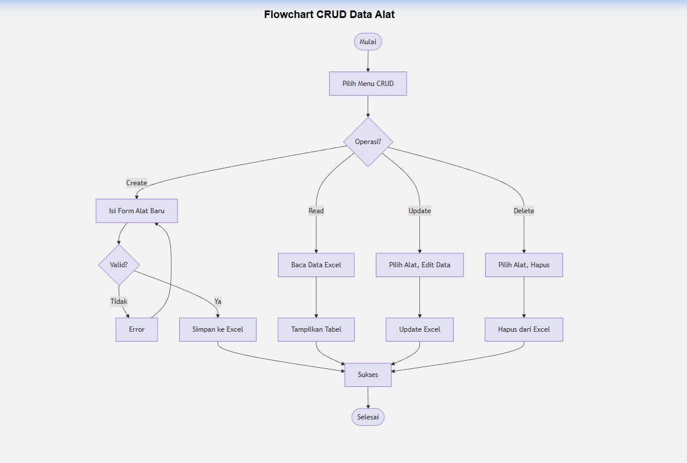
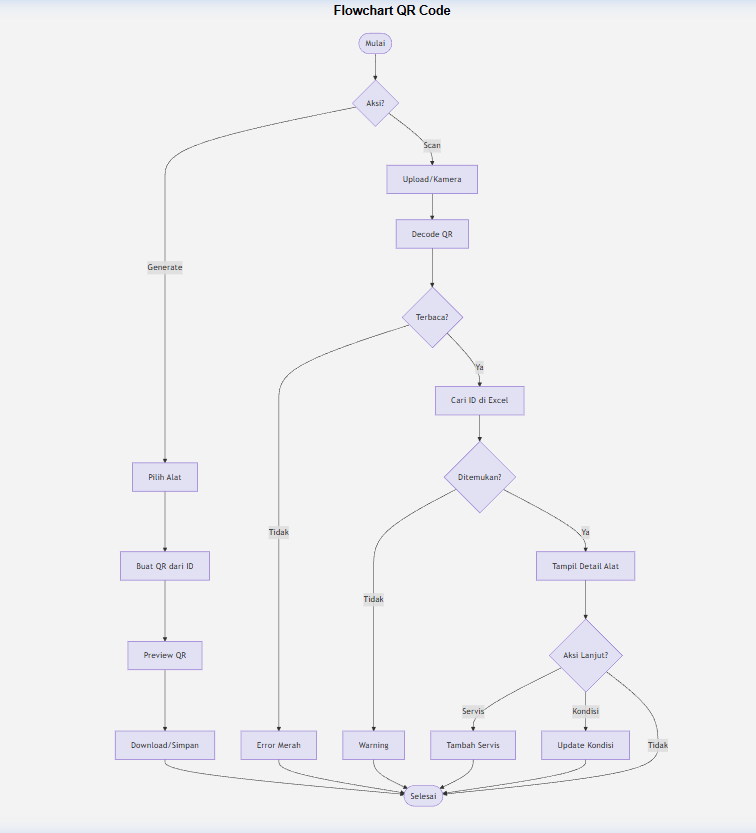

# Aplikasi Pencatatan Riwayat Peralatan Bengkel Motor dengan QR

Aplikasi berbasis Python + Streamlit untuk mencatat dan mengelola data peralatan bengkel motor menggunakan QR Code.

## Anggota Kelompok

| Nama | NPM |
|------|-----|
| Dio Yoga Pratama | 24020081 |
| Hamdani | 24020084 |
| Irfan Nurul Syahat | 24020090 |

## Cara Menjalankan

```bash
pip install -r requirements.txt
python -m streamlit run app.py
```

## Struktur Folder

```
/project
├── app.py              # File utama Streamlit
├── utils.py            # Fungsi-fungsi utilitas
├── requirements.txt    # Daftar library
├── /data               # Database Excel
└── /qr                 # File QR Code
```

## Fitur
- Dashboard dengan statistik dan grafik
- CRUD Data Alat
- Generate dan Scan QR Code
- Riwayat Servis

## Flowchart

### Flowchart CRUD


### Flowchart QR Code

